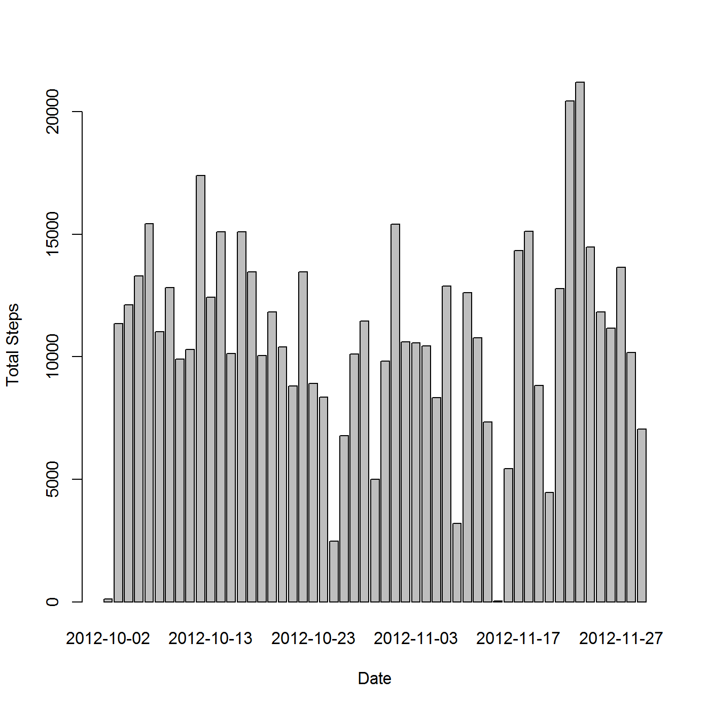
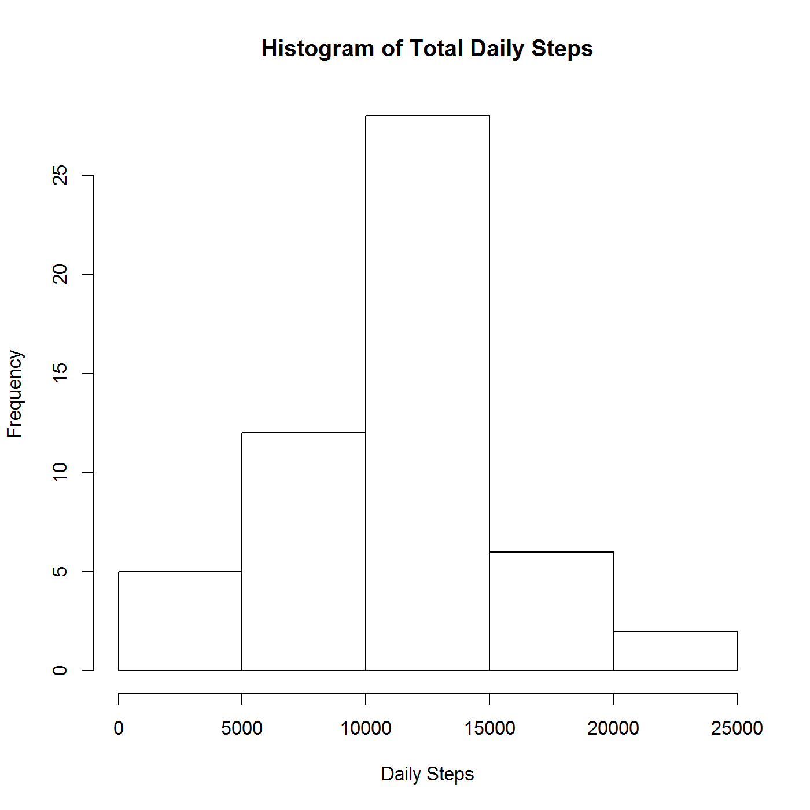
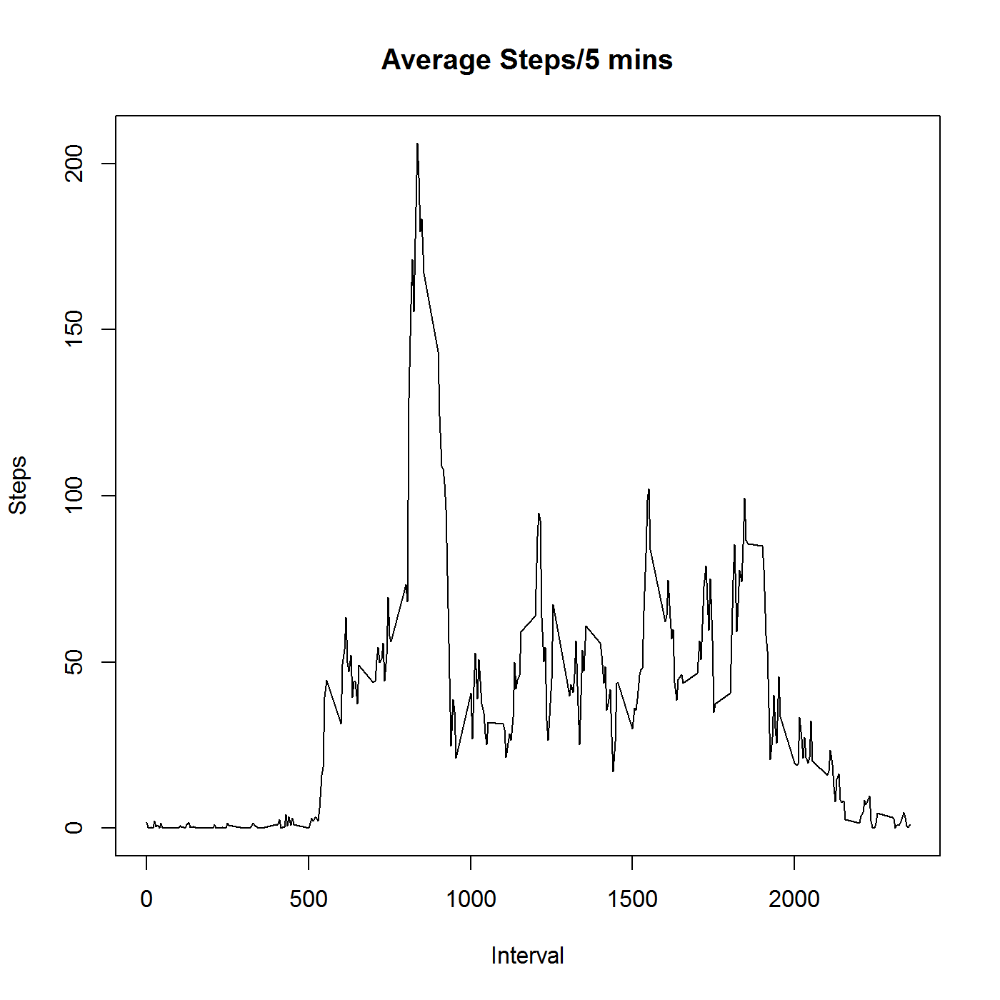
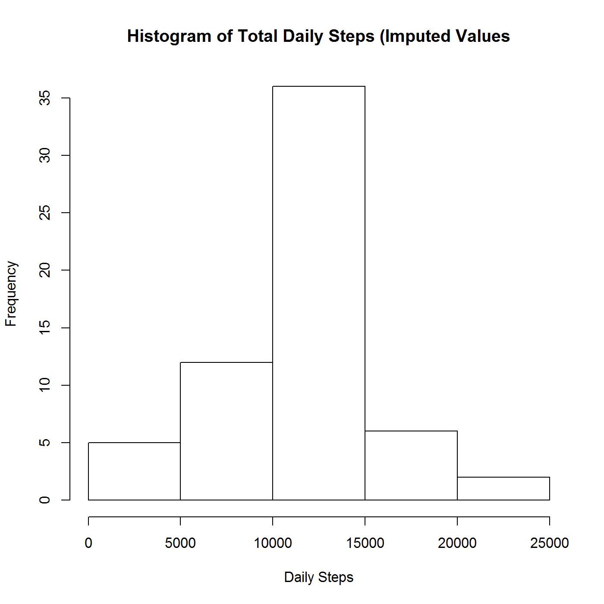
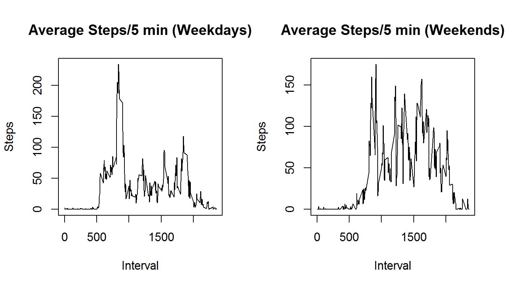

# Reproducible Research: Peer Assessment 1

## Loading and preprocessing the data

First we set some parameters...


```r
compressedFile <-"activity.zip"
dataFile <- "activity.csv"
opts_chunk$set(out.width='750px', dpi=200, echo=TRUE)
```
Then we unzip and load the data...


```r
if(!file.exists(dataFile)) {
  unzip(compressedFile, exdir = ".")
}
activity <- read.csv(dataFile, stringsAsFactors = FALSE)
```
Then we preprocess the dataset...

```r
library(stringr)
activity$interval<-str_pad(as.character(activity$interval), 4, pad = "0")  
```

## What is mean total number of steps taken per day?
### Calculate the total number of steps taken per day

```r
library(xtable)
dailySteps<-aggregate(steps ~ date, data=activity, FUN = sum, na.rm=FALSE)

with (dailySteps, {
  table<-xtable(dailySteps)
  print(table, type="html")
  barplot(steps, names.arg=date,xlab="Date",ylab="Total Steps")
})
```

<!-- html table generated in R 3.2.2 by xtable 1.8-0 package -->
<!-- Fri Dec 11 14:48:32 2015 -->
<table border=1>
<tr> <th>  </th> <th> date </th> <th> steps </th>  </tr>
  <tr> <td align="right"> 1 </td> <td> 2012-10-02 </td> <td align="right"> 126 </td> </tr>
  <tr> <td align="right"> 2 </td> <td> 2012-10-03 </td> <td align="right"> 11352 </td> </tr>
  <tr> <td align="right"> 3 </td> <td> 2012-10-04 </td> <td align="right"> 12116 </td> </tr>
  <tr> <td align="right"> 4 </td> <td> 2012-10-05 </td> <td align="right"> 13294 </td> </tr>
  <tr> <td align="right"> 5 </td> <td> 2012-10-06 </td> <td align="right"> 15420 </td> </tr>
  <tr> <td align="right"> 6 </td> <td> 2012-10-07 </td> <td align="right"> 11015 </td> </tr>
  <tr> <td align="right"> 7 </td> <td> 2012-10-09 </td> <td align="right"> 12811 </td> </tr>
  <tr> <td align="right"> 8 </td> <td> 2012-10-10 </td> <td align="right"> 9900 </td> </tr>
  <tr> <td align="right"> 9 </td> <td> 2012-10-11 </td> <td align="right"> 10304 </td> </tr>
  <tr> <td align="right"> 10 </td> <td> 2012-10-12 </td> <td align="right"> 17382 </td> </tr>
  <tr> <td align="right"> 11 </td> <td> 2012-10-13 </td> <td align="right"> 12426 </td> </tr>
  <tr> <td align="right"> 12 </td> <td> 2012-10-14 </td> <td align="right"> 15098 </td> </tr>
  <tr> <td align="right"> 13 </td> <td> 2012-10-15 </td> <td align="right"> 10139 </td> </tr>
  <tr> <td align="right"> 14 </td> <td> 2012-10-16 </td> <td align="right"> 15084 </td> </tr>
  <tr> <td align="right"> 15 </td> <td> 2012-10-17 </td> <td align="right"> 13452 </td> </tr>
  <tr> <td align="right"> 16 </td> <td> 2012-10-18 </td> <td align="right"> 10056 </td> </tr>
  <tr> <td align="right"> 17 </td> <td> 2012-10-19 </td> <td align="right"> 11829 </td> </tr>
  <tr> <td align="right"> 18 </td> <td> 2012-10-20 </td> <td align="right"> 10395 </td> </tr>
  <tr> <td align="right"> 19 </td> <td> 2012-10-21 </td> <td align="right"> 8821 </td> </tr>
  <tr> <td align="right"> 20 </td> <td> 2012-10-22 </td> <td align="right"> 13460 </td> </tr>
  <tr> <td align="right"> 21 </td> <td> 2012-10-23 </td> <td align="right"> 8918 </td> </tr>
  <tr> <td align="right"> 22 </td> <td> 2012-10-24 </td> <td align="right"> 8355 </td> </tr>
  <tr> <td align="right"> 23 </td> <td> 2012-10-25 </td> <td align="right"> 2492 </td> </tr>
  <tr> <td align="right"> 24 </td> <td> 2012-10-26 </td> <td align="right"> 6778 </td> </tr>
  <tr> <td align="right"> 25 </td> <td> 2012-10-27 </td> <td align="right"> 10119 </td> </tr>
  <tr> <td align="right"> 26 </td> <td> 2012-10-28 </td> <td align="right"> 11458 </td> </tr>
  <tr> <td align="right"> 27 </td> <td> 2012-10-29 </td> <td align="right"> 5018 </td> </tr>
  <tr> <td align="right"> 28 </td> <td> 2012-10-30 </td> <td align="right"> 9819 </td> </tr>
  <tr> <td align="right"> 29 </td> <td> 2012-10-31 </td> <td align="right"> 15414 </td> </tr>
  <tr> <td align="right"> 30 </td> <td> 2012-11-02 </td> <td align="right"> 10600 </td> </tr>
  <tr> <td align="right"> 31 </td> <td> 2012-11-03 </td> <td align="right"> 10571 </td> </tr>
  <tr> <td align="right"> 32 </td> <td> 2012-11-05 </td> <td align="right"> 10439 </td> </tr>
  <tr> <td align="right"> 33 </td> <td> 2012-11-06 </td> <td align="right"> 8334 </td> </tr>
  <tr> <td align="right"> 34 </td> <td> 2012-11-07 </td> <td align="right"> 12883 </td> </tr>
  <tr> <td align="right"> 35 </td> <td> 2012-11-08 </td> <td align="right"> 3219 </td> </tr>
  <tr> <td align="right"> 36 </td> <td> 2012-11-11 </td> <td align="right"> 12608 </td> </tr>
  <tr> <td align="right"> 37 </td> <td> 2012-11-12 </td> <td align="right"> 10765 </td> </tr>
  <tr> <td align="right"> 38 </td> <td> 2012-11-13 </td> <td align="right"> 7336 </td> </tr>
  <tr> <td align="right"> 39 </td> <td> 2012-11-15 </td> <td align="right">  41 </td> </tr>
  <tr> <td align="right"> 40 </td> <td> 2012-11-16 </td> <td align="right"> 5441 </td> </tr>
  <tr> <td align="right"> 41 </td> <td> 2012-11-17 </td> <td align="right"> 14339 </td> </tr>
  <tr> <td align="right"> 42 </td> <td> 2012-11-18 </td> <td align="right"> 15110 </td> </tr>
  <tr> <td align="right"> 43 </td> <td> 2012-11-19 </td> <td align="right"> 8841 </td> </tr>
  <tr> <td align="right"> 44 </td> <td> 2012-11-20 </td> <td align="right"> 4472 </td> </tr>
  <tr> <td align="right"> 45 </td> <td> 2012-11-21 </td> <td align="right"> 12787 </td> </tr>
  <tr> <td align="right"> 46 </td> <td> 2012-11-22 </td> <td align="right"> 20427 </td> </tr>
  <tr> <td align="right"> 47 </td> <td> 2012-11-23 </td> <td align="right"> 21194 </td> </tr>
  <tr> <td align="right"> 48 </td> <td> 2012-11-24 </td> <td align="right"> 14478 </td> </tr>
  <tr> <td align="right"> 49 </td> <td> 2012-11-25 </td> <td align="right"> 11834 </td> </tr>
  <tr> <td align="right"> 50 </td> <td> 2012-11-26 </td> <td align="right"> 11162 </td> </tr>
  <tr> <td align="right"> 51 </td> <td> 2012-11-27 </td> <td align="right"> 13646 </td> </tr>
  <tr> <td align="right"> 52 </td> <td> 2012-11-28 </td> <td align="right"> 10183 </td> </tr>
  <tr> <td align="right"> 53 </td> <td> 2012-11-29 </td> <td align="right"> 7047 </td> </tr>
   </table>


### Make a histogram of the total number of steps taken each day


```r
hist(dailySteps$steps,xlab="Daily Steps", main="Histogram of Total Daily Steps")
```



### Calculate and report the mean and median of the total number of steps taken per day

```r
mean(dailySteps$steps)
```

```
## [1] 10766.19
```

```r
median(dailySteps$steps)
```

```
## [1] 10765
```

## What is the average daily activity pattern?  

### Make a time series plot (i.e. type = "l") of the 5-minute interval (x-axis) and the average number of steps taken, averaged across all days (y-axis)

```r
dailyPattern<-aggregate(steps ~ interval,data=activity, FUN=mean, na.rm=TRUE)
with(dailyPattern, {
  plot(interval, steps, type="l",xlab="Interval",ylab="Steps",main="Average Steps/5 mins")
})
```



### Which 5-minute interval, on average across all the days in the dataset, contains the maximum number of steps?

```r
maxInterval<-dailyPattern[dailyPattern$steps==max(dailyPattern$steps),1]
maxInterval<-paste(substr(maxInterval, 1, 2), ":",substr(maxInterval, 3, 4),sep="")
maxInterval
```

```
## [1] "08:35"
```

## Imputing missing values
### Calculate and report the total number of missing values in the dataset (i.e. the total number of rows with NAs)

```r
numNAs<-nrow(activity[is.na(activity$steps),])
numNAs
```

```
## [1] 2304
```
### Devise a strategy for filling in all of the missing values in the dataset. The strategy does not need to be sophisticated. For example, you could use the mean/median for that day, or the mean for that 5-minute interval, etc.

There appears to be a substantial variance in steps taken of the course of the average day, much moreso then the variance in the total steps taken per day.

As such, in filling in assumed values for missing values we will take the mean for that interval over all days.

### Create a new dataset that is equal to the original dataset but with the missing data filled in.

```r
activityFilled<-activity
count=0
for (curr_row in seq_len(nrow(activityFilled))) {
  if (is.na(activityFilled[curr_row,1])) {
    count=count+1
    activityFilled[curr_row,1] <- round((dailyPattern[dailyPattern$interval==activityFilled[curr_row,3],2]))
  }

}
```
### Make a histogram of the total number of steps taken each day and Calculate and report the mean and median total number of steps taken per day. Do these values differ from the estimates from the first part of the assignment? What is the impact of imputing missing data on the estimates of the total daily number of steps?


```r
dailyStepsFilled<-aggregate(steps ~ date, data=activityFilled, FUN = sum, na.rm=FALSE)
hist(dailyStepsFilled$steps,xlab="Daily Steps", main="Histogram of Total Daily Steps (Imputed Values")
```



```r
mean(dailyStepsFilled$steps)
```

```
## [1] 10765.64
```

```r
median(dailyStepsFilled$steps)
```

```
## [1] 10762
```

Imputing values for the missing values, has had little effect on the mean and median as the imputed values were representative of the sample. On the other hand, the total values have risen as can be seen by the new histogram.

## Are there differences in activity patterns between weekdays and weekends?

### Create a new factor variable in the dataset with two levels - "weekday" and "weekend" indicating whether a given date is a weekday or weekend day.

```r
activity$Date<-as.Date(activity$date)
for (curr_row in seq_len(nrow(activity))) {
  dayOfWeek<-weekdays(activity$Date[curr_row])
  weekday<-if (dayOfWeek=="Saturday" | dayOfWeek=="Sunday") {"weekend"} else {"weekday"}
  activity$weekday[curr_row]<-weekday
}
activity$weekday<-factor(activity$weekday)
```

### Make a panel plot containing a time series plot (i.e. type = "l") of the 5-minute interval (x-axis) and the average number of steps taken, averaged across all weekday days or weekend days (y-axis). See the README file in the GitHub repository to see an example of what this plot should look like using simulated data.


```r
par(mfcol=c(1,2))
weekdayData<-activity[activity$weekday=="weekday",]
weekendData<-activity[activity$weekday=="weekend",]
weekdayPattern<-aggregate(steps ~ interval,data=weekdayData, FUN=mean, na.rm=TRUE)
weekendPattern<-aggregate(steps ~ interval,data=weekendData, FUN=mean, na.rm=TRUE)
with(weekdayPattern, {
  plot(interval, steps, type="l",xlab="Interval",ylab="Steps",main="Average Steps/5 min (Weekdays)")
})
with(weekendPattern, {
  plot(interval, steps, type="l",xlab="Interval",ylab="Steps",main="Average Steps/5 min (Weekends)")
})
```



It would seem that the number of steps peaks higher on weekdays that it does on weekends (in the morning) whereas the overall level tends to stay higher throughout the weekend days.
